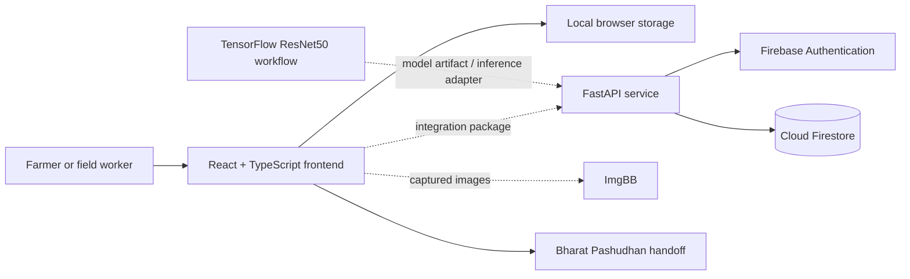

<div align="center">

# PashuDrishti

### Livestock Breed Intelligence for the Field

An offline-aware, bilingual platform for identifying Indian cattle and buffalo breeds, exploring breed-specific care guidance, and preparing records for official livestock workflows.

[](https://react.dev/)
[](https://www.typescriptlang.org/)
[](https://fastapi.tiangolo.com/)
[](https://www.tensorflow.org/)
[](https://firebase.google.com/)

</div>

## Overview

PashuDrishti is a field-oriented livestock intelligence system designed for farmers and livestock workers in India. It combines a mobile-first web experience with breed reference data, guided multi-angle image capture, nutrition and breeding guidance, community features, and a handoff workflow for Bharat Pashudhan registration.

The repository contains three complementary parts:

- a polished React/Vite product prototype in `frontend_app/`;
- a FastAPI and Firebase backend in `Backend/`; and
- a TensorFlow/ResNet50 training pipeline in `model/` for classifying 20 Indian cattle breeds.

> [!IMPORTANT]
> The default frontend currently uses deterministic demo scenarios for breed detection. The backend integration files are staged separately in `frontend changed/`, and the TensorFlow model is a standalone training workflow. See [Current integration status](#current-integration-status) before using the project in production.

## Why PashuDrishti?

Breed identification in the field is often constrained by limited connectivity, inconsistent image quality, and fragmented access to reliable husbandry information. PashuDrishti brings these workflows into one approachable interface:

- **Guided breed identification** using face, side-profile, and horn/hump photographs.
- **Transparent results** with confidence scores, alternative matches, visual indicators, and image-quality checks.
- **Regional context** that explains whether a predicted breed is common in the user's area.
- **Practical husbandry support** covering nutrition, crossbreeding, breed comparison, and saved reference profiles.
- **English and Hindi UI** for more accessible field use.
- **Offline-aware storage** for saved breeds, recent identifications, and interface preferences.
- **Farmer communities** organized around individual breeds.
- **Government workflow handoff** that prepares a structured field dossier for Bharat Pashudhan/INAPH entry.

## Product capabilities

| Area | What it provides |
| --- | --- |
| Breed scanner | Three-step photo capture, upload support, camera access, and image-quality guidance |
| Detection results | Confidence, alternative breeds, morphological indicators, regional relevance, and correction flow |
| Breed knowledge | Profiles for indigenous cattle and buffalo breeds, comparisons, traits, and regional information |
| Nutrition | Breed-aware fodder quantities, ration schedules, and feed-plan references |
| Breeding advisory | Crossbreeding recommendations and explanatory notes |
| Field usability | Responsive mobile frame, voice controls, bilingual content, and offline-mode simulation |
| Community | Breed-specific posts, comments, flagging, and role-restricted moderation APIs |
| Record handoff | Registration checklist and copyable Bharat Pashudhan field summary |

## Architecture



The frontend is deliberately usable as a standalone product demo. Firebase-backed authentication, animal records, predictions, and communities become available after applying the integration package and completing the remaining wiring described below.

## Repository structure

```text
submission/
|-- frontend_app/              # Primary mobile-first React/Vite prototype
|   |-- src/components/        # Shared UI and navigation
|   |-- src/context/           # App and language state
|   |-- src/data/              # Breed, feed, market, and community fixtures
|   |-- src/screens/           # Product screens
|   `-- src/services/          # Detection, storage, voice, and domain services
|-- Backend/
|   |-- backend/main.py        # FastAPI application entry point
|   |-- backend/routes_*.py    # User, animal, prediction, and community routes
|   |-- backend/firebase_setup.py
|   `-- seed_reference_data.py # Initial Firestore reference records
|-- model/
|   |-- model.py               # ResNet50 transfer-learning workflow
|   `-- classes.json           # Ordered list of 20 breed classes
|-- frontend changed/          # Backend/Firebase integration patch set
`-- package.json               # Root convenience scripts for frontend_app
```

## Quick start

### Prerequisites

- [Node.js](https://nodejs.org/) 18 or newer
- npm 9 or newer
- A modern browser with camera support for live capture

### Run the product demo

```bash
git clone https://github.com/tatha07/submission.git
cd submission
npm --prefix frontend_app install
npm run dev
```

Open [http://localhost:3000](http://localhost:3000). The default app is self-contained and does not require Firebase or the Python backend.

### Available frontend commands

| Command | Description |
| --- | --- |
| `npm run dev` | Start Vite on port `3000` and expose it on the local network |
| `npm run build` | Create an optimized production build |
| `npm run preview` | Preview the production build locally |
| `npm run lint` | Run TypeScript checks without emitting files |

## Backend setup

The backend provides authenticated profile, animal, prediction-record, feed-plan, breeding-advice, and community endpoints.

### 1. Create a Python environment

```bash
cd Backend
python -m venv .venv
```

Activate it:

```bash
# macOS/Linux
source .venv/bin/activate

# Windows PowerShell
.venv\Scripts\Activate.ps1
```

Install the dependencies:

```bash
pip install -r requirements.txt
```

### 2. Configure Firebase Admin

1. Create or select a Firebase project.
2. Enable Firebase Authentication and Cloud Firestore.
3. Generate a service-account key and save it as `Backend/serviceAccountKey.json`.
4. Copy the environment template:

```bash
cp .env.example .env
```

On Windows PowerShell, use `Copy-Item .env.example .env`.

Update at least these values:

```dotenv
GOOGLE_APPLICATION_CREDENTIALS="./serviceAccountKey.json"
FIREBASE_PROJECT_ID="your-firebase-project-id"
```

> [!CAUTION]
> Never commit `serviceAccountKey.json`, `.env`, Firebase private keys, or ImgBB credentials.

### 3. Start the API

From `Backend/`:

```bash
uvicorn backend.main:app --reload --env-file .env
```

The service is available at:

- API: [http://localhost:8000](http://localhost:8000)
- Swagger UI: [http://localhost:8000/docs](http://localhost:8000/docs)
- ReDoc: [http://localhost:8000/redoc](http://localhost:8000/redoc)
- Health check: [http://localhost:8000/health](http://localhost:8000/health)

### 4. Seed reference records

With the Firebase credentials configured and the virtual environment active:

```bash
python seed_reference_data.py
```

This creates initial breed, community, feed-plan, and breeding-recommendation documents for Gir, Sahiwal, and Murrah.

## API overview

Protected routes require a Firebase ID token in the request header:

```http
Authorization: Bearer <firebase-id-token>
```

| Method | Route | Authentication | Purpose |
| --- | --- | --- | --- |
| `GET` | `/health` | No | Check API and database status |
| `POST` | `/users/profile` | Yes | Create a farmer or field-worker profile |
| `POST` | `/animals` | Yes | Register an animal and its rough location |
| `PATCH` | `/animals/{animal_id}/confirm-breed` | Yes | Confirm an identified breed |
| `POST` | `/predictions` | Yes | Store model results for an owned animal |
| `POST` | `/predictions/correct` | Yes | Save a user correction and reuse consent |
| `GET` | `/breeds/{breed_id}/feed-plan` | No | Retrieve feed recommendations |
| `GET` | `/breeds/{breed_id}/breeding-advice` | No | Retrieve breeding guidance |
| `GET` | `/community/{breed_id}/posts` | No | List unflagged breed-community posts |
| `POST` | `/community/posts` | Yes | Publish a community post |
| `POST` | `/community/comments` | Yes | Add a comment to a post |
| `POST` | `/community/posts/{breed_id}/{post_id}/flag` | Yes | Flag inappropriate content |
| `DELETE` | `/community/posts/{breed_id}/{post_id}` | Admin | Moderate and remove a post |

## ML training workflow

`model/model.py` uses transfer learning with ImageNet-pretrained ResNet50 and the Kaggle **Indian Cattle Image Dataset**. It trains a softmax classifier for the 20 classes listed in `model/classes.json`.

### Model outline

- Input size: `224 x 224 x 3`
- Base network: ResNet50 without the classification head
- Augmentation: horizontal flip, rotation, and zoom
- Phase 1: frozen-base warm-up training
- Phase 2: fine-tuning of the final ResNet layers
- Output artifact: `indian_cattle_resnet50_finetuned.keras`

The model directory does not currently include a pinned Python requirements file or a trained `.keras` artifact. A typical notebook/Colab environment will need:

```bash
cd model
pip install tensorflow kagglehub matplotlib
python model.py
```

Review the script before running it: it downloads a third-party Kaggle dataset, expects GPU-capable resources for practical training times, and currently contains a checkpoint-loading line intended for resumed training. Remove or adjust that line for a clean first run.

### Supported classes

<details>
<summary>View all 20 cattle breeds</summary>

Amritmahal, Bachaur, Bargur, Dangi, Deoni, Gir, Hariana, Kankrej, Kenwariya, Kherigarh, Khillari, Malvi, Nagori, Nimari, Ongole, Rathi, Red Kandhari, Red Sindhi, Sahiwal, and Tharparkar.

</details>

## Current integration status

This repository captures a strong end-to-end product direction, but its components are not yet connected by default:

| Component | Status |
| --- | --- |
| `frontend_app/` | Fully navigable product demo with local persistence and simulated identification results |
| `Backend/` | Firebase-backed API for records and communities; no live `/predict` inference route yet |
| `model/` | Standalone training script; trained model artifact and serving adapter are not committed |
| `frontend changed/` | Partial Firebase/API integration package that must be merged into `frontend_app/` |

To complete the production path:

1. Merge the files from `frontend changed/` into the primary frontend.
2. Add an animal-registration step before image analysis.
3. Implement a backend `/predict` route that loads the trained model once at startup.
4. Normalize uploaded images to the model's `224 x 224` ResNet50 input contract.
5. Return predictions in the response shape expected by `apiService.predictBreed()`.
6. Add integration tests for authentication, ownership checks, prediction persistence, and community moderation.

## Data, safety, and responsible use

- Breed predictions are decision support, not an official registry determination.
- Low-confidence or crossbred cases should be reviewed by a qualified livestock professional.
- Obtain consent before collecting animal-owner details or reusing corrected images for model training.
- Keep Firebase Admin credentials server-side and restrict production CORS origins.
- Replace public image hosting with an approved storage policy before handling real field data.
- Validate husbandry guidance against current ICAR, NDDB, and local veterinary recommendations before operational use.

## Roadmap

- [ ] Serve the trained classifier through FastAPI
- [ ] Complete Firebase-enabled frontend integration
- [ ] Add animal registration and ear-tag lookup
- [ ] Replace demo profiles and scenarios with authenticated user data
- [ ] Package an offline inference model using TFLite or ONNX
- [ ] Expand and validate buffalo-breed coverage
- [ ] Add automated frontend, API, and model-quality tests
- [ ] Introduce deployment manifests and environment-specific CORS policies

## Contributing

Contributions are welcome. For a clean contribution workflow:

1. Fork the repository and create a focused feature branch.
2. Keep product-demo, backend, and ML changes clearly separated.
3. Run `npm run lint` and `npm run build` for frontend changes.
4. Test backend changes through `/docs` and include request/response examples.
5. Document any dataset, label-order, or preprocessing changes that affect model compatibility.
6. Open a pull request describing the problem, implementation, and verification performed.

## License

No license file is currently included. Until a license is added, the repository remains under standard copyright and may not be reused, modified, or redistributed without the copyright holder's permission.

---

<div align="center">

Built to make livestock intelligence more accessible, explainable, and useful in the field.

</div>
